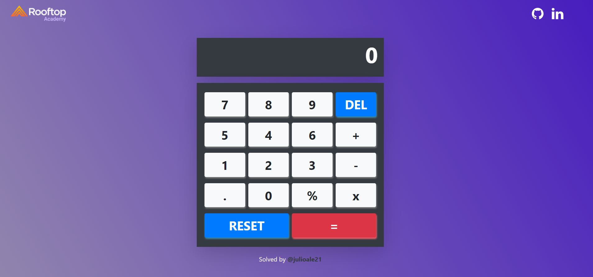
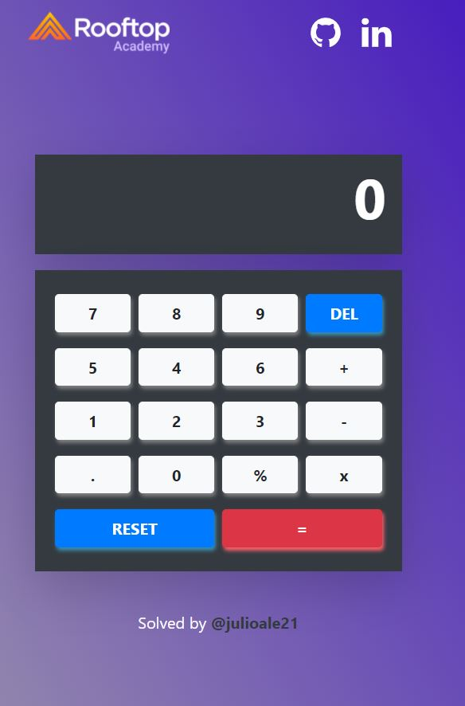

   <h1 align="center">React Calculator - Rooftop Academy</h1>
   

  
## The objetive

Your objetive is to build a calculator app.

**Bonus:** Use react redux

## Desktop Design

  

## Mobile Design

  

## Demo
[https://rooftop-react-calculator.netlify.app/](https://rooftop-react-calculator.netlify.app/)

## Project
### Tools

- React.js
- Create-react-app
- React-Bootstrap
- React Redux

### Project Structure
The files are structured as follow:

    .
    ├── docs
    ├── public               # Static Files
    ├── src
        ├── components  
        ├── interfaces
        ├── redux 
        App.css
        App.tsx
        index.tsx

    └── README.md            # The first page that the user will view when will visit the repository.

## Requirements
* npm or yarn
* Git

## Local deployment

* Clone repository.
* Execute the command `npm install`
* Execute the command `npm run start`
